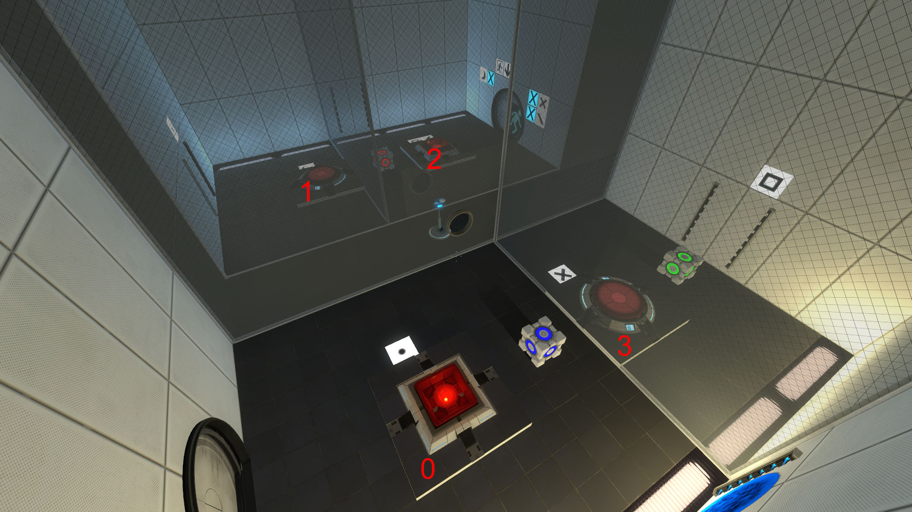

# Rearrange, Guarantee, Benefit

https://steamcommunity.com/sharedfiles/filedetails/?id=1958945244

Looks like a simple simulation problem with backtracking.

## Start configuration

Player at 0, rooms (or buttons) are:

* 0 - opens orange portal at 1
* 1 - key_crescent
* 2 - opens orange portal at 3 + key_backslash
* 3 - key_cross

Cubes in rooms 0,2,3 (color doesn't matter).
Every step there's a new blue portal sequentaly in room 0 and then in room 2.

## Final configuration:

* Player at 2, cubes at 1,2,3

## Shortest solution (not proven)

* BLUE on DOT
* RED on SQUARE
* take GREEN
* trigger DOT
* GREEN on CRESCENT
* trigger SQUARE
* BLUE on X

### Video

